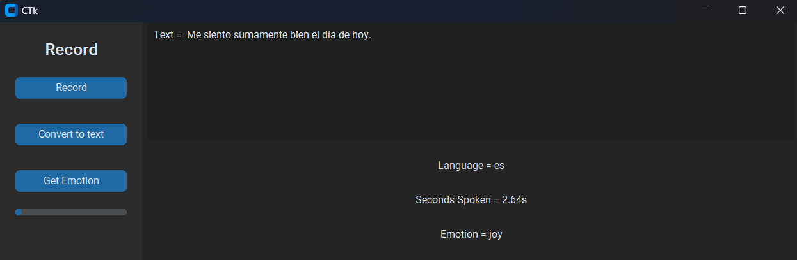
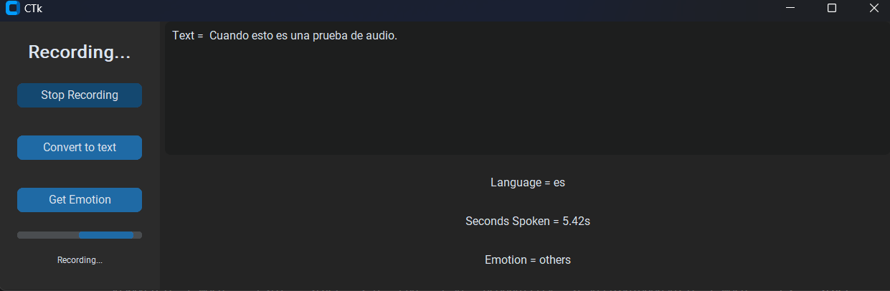

# **Speech-to-text and Emotion Recognition System (TER)**

## Description
This project introduces a Speech-to-Text and Emotion Recognition (TER) system designed to process audio and text in ***multiple languages***. It leverages pre-trained Deep Learning models to offer a comprehensive solution that includes audio recording, voice-to-text transcription using the Whisper model, and ***emotion detection in Spanish*** texts with pysentimiento.

### Key Features

- **Audio Recording**: The system enables direct audio recording from the user's device, making it easy to capture voice for further analysis.

- **Multilingual Transcription with Whisper**: Utilizing the powerful Deep Learning model Whisper from OpenAI, our system can convert recorded audio into text with support for multiple languages, offering precise and efficient transcription.

- **Emotion Detection in Spanish**: Through pysentimiento, a model specialized in sentiment and emotion analysis for Spanish, the system examines the transcribed text to identify emotions such as happiness, sadness, anger, among others.

## How It Works

1. **Audio Recording**: The user records their voice message using the system's interface.
2. **Speech2Text Transcription**: The recorded audio is processed with Whisper to obtain a textual transcription of the message.
3. **Emotion Analysis**: The transcribed text is analyzed with pysentimiento to detect and classify expressed emotions.

## Technologies Used

- **Whisper by OpenAI**: A voice-to-text transcription model that supports multiple languages.
- **pysentimiento**: A library for sentiment analysis and emotion detection in Spanish.
- Other technologies: Python, customtkinter.

## Installation and Usage

1. Install customtkinter, pyaudio, whisper, pysentimiento and transformers
2. Change the paths where the text is saved and uploaded.
* NOTE: You can change the emotion recognition to your language just adjusting the `pysentimiento` model: es, en, it, pt.

## Contributing

We welcome contributions from developers of all skill levels. If you're looking to make a significant impact, consider focusing on the following areas:

- **Multilanguage Emotion Detection**: Enhancing our emotion detection capabilities to support multiple languages. We're interested in expanding beyond Spanish to include a wider range of languages, ensuring our system can cater to a global audience. If you have expertise in natural language processing and multilingual models, your contributions would be highly valuable.

- **Speeding Up Speech-to-Text (S2T)**: Optimizing the S2T process to make it faster without compromising accuracy. This could involve exploring new models, tweaking existing frameworks, or implementing more efficient data processing techniques. If you have experience in performance optimization or deep learning model efficiency, your insights could greatly benefit our project.

To contribute, please follow these steps:

1. **Fork the Repository**: Start by forking the repository to your own GitHub account.
2. **Create a Feature Branch**: Work on your feature or improvement in a dedicated branch based on the `main` branch.
3. **Submit a Pull Request (PR)**: Once you're ready to share your contributions, submit a PR for review. Please provide a clear description of the changes and any additional information that might help understand your approach.
4. **Code Review**: Your PR will be reviewed by the maintainers. This process helps ensure that the addition aligns with the project goals and standards. Be open to feedback and ready to make adjustments as needed.

For more information, please refer to the official documentation of [Whisper](https://github.com/openai/whisper) and [pysentimiento](https://github.com/pysentimiento/pysentimiento).
